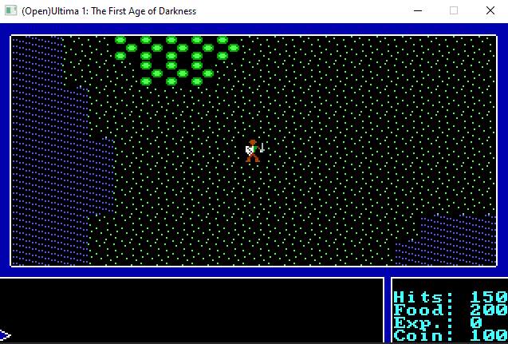

# open_ultima
An open source remake of Ultima 1: First Age of Darkness in very, very, very early stages of development.

This project is the result of my personal goal to better learn SDL and discover newer C++ features, so please keep that in mind when looking at the ugly code!

For compiling use CMake.

Requires (of course) the original game files, you can get them from GOG.com!

Dependencies:
- SDL 2.0.12
- SDL TTF 2.0.15
- SDL Image 2.0.5
- SDL Gfx

Features implemented:
  - Basic overworld.
  - Super basic dungeon crawling.
  - Basic dungeon combat.
  - Town and Castle (empty for now).

